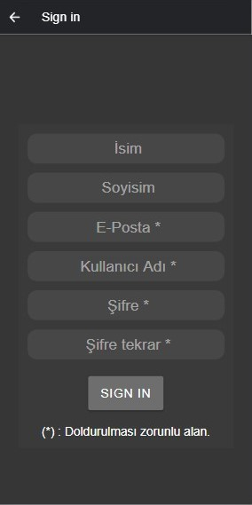

## Kocaeli Üniversitesi - Bilgisayar Mühendisliği
### Mobil Programlama Proje
#### Cemre Can Kaya - 190201137

 

## Humble 

Humble kullanıcıların resimlerini, tablolarını satışa sunabileceği bir platformdur.

## Kullanılan ekstra paketler

[Ionic Data Storage](https://ionicframework.com/docs/angular/storage)  
[Ionic Camera](https://ionicframework.com/docs/native/camera)

## Nasıl Çalıştırılır

 

Github içerisinde bulunan dosya indirildikten sonra Komut satırında klasör içerisine ;

    $  npm install

komutu ile proje içerisinde tanımlanan gerekli tüm node_module paketleri yüklenir.
  

! Proje içerisinde galeriden resim seçme işlemi yapıldığı için Ionic Camera kütüphanesi kullanıldı ancak Camera kütüphanesi Browser tarafında desteklenmemekte. 

 

Bu sebeple uygulama Android Studio emulator ve ya android cihaz ile çalıştırılabilir. 
 

>Minimum Android SDK sürümü (27.+) 
>Apk dosyası klasörü içerisinden kurulum yapılabilir.

 

Diğer bir şekilde Android Studio emulator açık iken ve ya android cihaz USB debugging özelliği açık ve usb ile bilgisayara bağlı iken;

    $  ionic cordova run android

komutu ile çalıştırılabilir.

 
Dilenirse Browser üzerinde de çalıştırılabilir ancak resim seçme ve yükleme seçeneği çalışmayacaktır. Browser' da çalıştırmak için;
 

    $  ionic serve

 
 
## Proje hakkında
 
Uygulama giriş, çıkış işlemleri ve veritabanından veri çekme işlemleri server tarafında yazılan Php API ile gerçekleştirilir. Uygulama veritabanına, yazılan API üzerinden erişebilir.  

## Uygulamanın kullanımı

Uygulama açılış ekranında kullanıcı giriş, kayıt işlemleri gerçekleştirilir.

  

  
Yan tarafta açılır menu bulunmaktadır tüm menülere buradan ulaşılır.
  

  
Anasayfada kullanıcıların satışa sunduğu resimler görüntülenir, resimlere teklif yapılabilir.
  

  
Profil sayfasında kullanıcı bilgileri güncellenebilir.
  

  
Resimlerim sayfasında kullanıcının uygulamaya yüklediği resimler görüntülenir, kullanıcı uygulamaya yüklediği resimlerini buradan başlangıç fiyatı ile birlikte satışa çıkarabilir, satıştan çekebilir ve ya resmini uygulamadan silebilir.
  

  
Resimlerim sayfasında, Resim ekle butonuna tıklandığında resim ekleme sayfası açılır ve istenilen resim galeriden seçilip eklenebilir.
  

  

